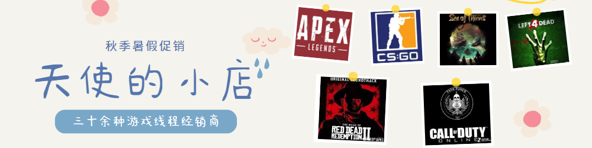

# ☀ 天使Wiki教程文档

## **作者**

### **此Wiki教程由**<mark style="color:red;">**红中作者**</mark>**提供，并通过**<mark style="color:red;">**红中作者**</mark>**同意转载**

**在此感谢红中作者的支持，以下是红中作者的原创地址**

> ****[<mark style="color:red;">**原创地址**</mark>](https://docs.wiki.hzcheats.one/)<mark style="color:red;">****</mark>

****

****


<mark style="color:green;">**建议Ctrl+D收藏此教程网**</mark>

**推荐使用电脑端查看教程**

**你可以在本文档下方**

**找到菜单推荐列表，方便你选择心仪的菜单**

**或者找到你购买的辅助 查看教程**

<mark style="color:green;">**由于此文档篇幅较多，需仔细耐心查看**</mark>f all your features! use them to encourage folks to perform certain actions and discover the value in your product.


<figure><figcaption></figcaption></figure>

## 概述

> <mark style="color:green;">**>二十余种菜单经销商**</mark>
>
> <mark style="color:green;">**>安装器UI设计-菜单主题UI设计-菜单功能图制作-菜单汉化与菜单更新日志**</mark>
>
> **点击下方【**[**发卡网/Shop**](https://tscheats.cc/)**】进入发卡网💞**

****

> <mark style="color:red;">**红中丨**</mark>[<mark style="color:red;">**HongZhong**</mark>](https://docs.wiki.hzcheats.one/) **  **<mark style="color:red;">**编写,转载署名！**</mark>
